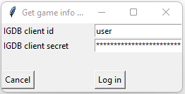
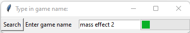
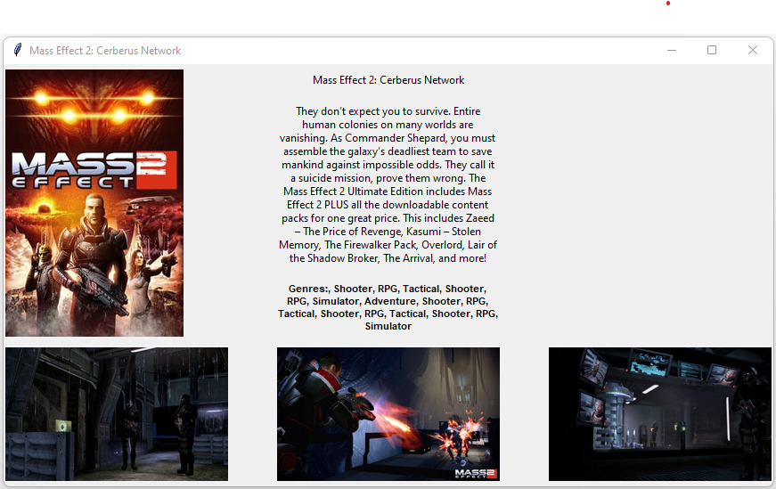

# GetGameInfo
App for searching for game info in igdb database.
Data is downloaded from https://api-docs.igdb.com/#about

<h3>User can:</h3>

- search for game info be game name,
- app displays game name, cover, screenshots, description and list of genres.

<h3>Used technologies:</h3>

- python,
- tkinter for creatig gui,
- requests for downloading game info with IGDB api,
- PIL for preparing and downloading images,
- Queue and threading for making api calls on separate thread.

<h3>App screenshots:</h3>

Login screen: 

 
 
Search screen: 

 
 
Game info screen: 

